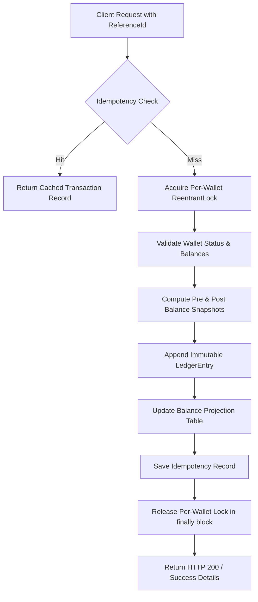

# Scalable Fintech Wallet System (LLD & Machine Coding)

A thread-safe, double-entry financial ledger and wallet service designed for modern fintech applications requiring strict data correctness, fine-grained concurrency control, idempotency, and auditability.

---

## 1. Core Architectural Principles

* **Ledger-First Architecture:** Wallets are not simple balance columns. Balance states (`availableBalance`, `lockedBalance`) are derived projections updated atomically alongside an immutable transaction ledger.
* **Double-Gated Idempotency:** Every balance-modifying API accepts a unique `referenceId`. Duplicate calls return the original transaction snapshot without re-applying mutations.
* **Separation of Available vs. Locked Funds:** Multi-phase operations (e.g., checkouts, withdrawal authorizations) reserve funds into a `LOCKED` state before final `CAPTURE` (deduction) or `RELEASE` (rollback).
* **Per-Wallet Concurrency Isolation:** Thread synchronization occurs per individual `Wallet` instance via fair `ReentrantLock(true)`, avoiding global lock contention across different customer accounts.
* **Single-Query Auditability:** Pre- and post-balance snapshots are stored on every immutable `LedgerEntry` record for regulatory traceability and reconciliation.

---

## 2. Low-Level Design & Component Structure

```text
org.example.wallet/
├── controller/
│   └── WalletController.java          # Entry router orchestrating API requests
├── enums/
│   ├── Currency.java                  # ISO currencies (USD, INR, EUR)
│   ├── HoldStatus.java                # ACTIVE, CAPTURED, RELEASED, EXPIRED
│   ├── TransactionStatus.java         # PENDING, COMPLETED, FAILED, REVERSED
│   ├── TransactionType.java           # CREDIT, DEBIT, RESERVE, RELEASE, CAPTURE
│   └── WalletStatus.java              # ACTIVE, SUSPENDED, CLOSED
├── model/
│   ├── Balance.java                   # Balance projection aggregate with versioning
│   ├── Hold.java                      # Temporary fund reservation aggregate
│   ├── LedgerEntry.java               # Immutable audit log record
│   └── Wallet.java                    # Customer wallet root entity with ReentrantLock
├── repository/
│   ├── InMemoryWalletRepository.java  # Thread-safe in-memory store using ConcurrentHashMap
│   └── WalletRepository.java          # Persistence interface abstraction
├── service/
│   ├── TransactionService.java        # Core ledger mutation & locking engine
│   └── WalletService.java             # Account lifecycle & hold monitoring
└── Main.java                          # End-to-end execution & concurrency harness
```

---

## 3. Transaction Execution Flow



---

## 4. Concurrency & Locking Strategy

* **Fine-Grained Locking:** Each `Wallet` instance maintains an internal `ReentrantLock(true)`.
* **Zero Global Bottleneck:** Operations on `Wallet A` run fully in parallel with `Wallet B`.
* **Safe Release Invariant:** All lock acquisitions strictly follow the `lock.lock()` followed by `try { ... } finally { lock.unlock(); }` pattern to guarantee no deadlocks or leaked locks on unexpected runtime exceptions.
* **Lock-Free Map Lookups:** The storage layer utilizes `ConcurrentHashMap` and `CopyOnWriteArrayList` for thread-safe reads and concurrent record retrieval.

---

## 5. Verification & Test Scenarios Covered in `Main.java`

1. **Wallet Onboarding:** Initialization of customer accounts with zeroed base projections.
2. **Direct Mutations (Credit / Debit):** Atomic deposits and deductions with overdraft prevention.
3. **Strict Idempotency Verification:** Sending identical `referenceId` tokens consecutively to verify no double-crediting occurs.
4. **Two-Phase Settlement (Reserve -> Capture):** Authorizing a hold, verifying balance splits, and settling permanently.
5. **Two-Phase Rollback (Reserve -> Release):** Authorizing a hold and returning locked funds back to available balance.
6. **Concurrent Race Condition Stress Test:** Running 10 simultaneous threads against a single wallet to verify zero overselling under race conditions.
7. **Audit Statement Generation:** Printing sequential pre- and post-balances from opening state to current state.