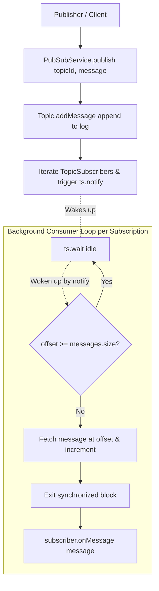

# In-Memory Pub-Sub & Kafka Message Broker (LLD & Machine Coding)

A thread-safe, concurrent in-memory publish-subscribe message broker system designed with independent subscriber offsets, asynchronous consumption loops, and replayability support.

---

## 1. Core Architectural Principles

* **Topic-Based Partitioning & Routing:** Publishers post messages to specific topics, and subscribers receive messages only from topics they are subscribed to.
* **Per-Subscription Dedicated Worker Threads:** Each `(Topic, Subscriber)` subscription pair runs its own asynchronous consumption loop in a background thread without blocking other consumers.
* **Independent Atomic Offsets:** Each subscriber tracks its own position in a topic log via `AtomicInteger offset`, enabling non-interfering consumption rates.
* **Non-Blocking Execution Invariant:** The consumer callback `subscriber.onMessage(message)` executes outside monitor locks so processing delays do not hold thread locks.
* **Replayability via Offset Resets:** Offsets can be reset at runtime to any historical index to re-consume past messages sequentially.

---

## 2. Low-Level Design & Component Structure

```text
org.example.pubsub/
├── controller/
│   └── PubSubController.java          # Orchestrates topic, subscription, and message endpoints
├── model/
│   ├── Message.java                   # Immutable message entity with ID and payload
│   ├── SimpleSubscriber.java          # Concrete subscriber implementation
│   ├── Subscriber.java                # Abstract base subscriber definition
│   ├── Topic.java                     # Synchronized message log container
│   └── TopicSubscriber.java           # Bridges Topic and Subscriber with an AtomicInteger offset
├── repository/
│   ├── InMemoryPubSubRepository.java  # Thread-safe storage with ConcurrentHashMap and CopyOnWriteArrayList
│   └── PubSubRepository.java          # Storage interface abstraction
├── service/
│   └── PubSubService.java             # Core message routing, wait-notify logic, and thread pool
└── Main.java                          # End-to-end execution and verification suite
```

---

## 3. Asynchronous Consumer Flow



---

## 4. Concurrency & Thread Synchronization

* **Wait / Notify Pattern:** When there are no new messages, the subscriber loop calls `ts.wait()` on its dedicated `TopicSubscriber` instance, releasing the lock and consuming 0% CPU.
* **Signal on Publish:** When a publisher pushes a new message, it wakes up all sleeping subscription threads on that topic via `ts.notify()`.
* **Lock-Free Fast Reads:** Topic subscription lists use `CopyOnWriteArrayList` to ensure iteration during publishing does not collide with new subscriber registrations.

---

## 5. Verification & Test Scenarios Covered in `Main.java`

1. **Multi-Topic Creation:** Initializing distinct topics (`ORDER_CREATED`, `PAYMENT_COMPLETED`).
2. **Fan-In / Fan-Out Subscriptions:** Single subscriber consuming from multiple topics, and multiple subscribers consuming from a single topic concurrently.
3. **Asynchronous Parallel Processing:** Non-blocking message consumption across active workers.
4. **Offset Reset & Message Replay:** Resetting a subscriber offset to `0` and verifying historical messages are re-delivered without affecting other subscribers.
5. **Graceful Shutdown:** Stopping the thread pool cleanly with timeout-bounded termination.